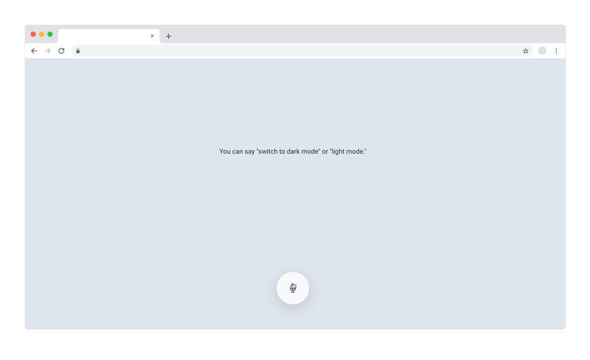
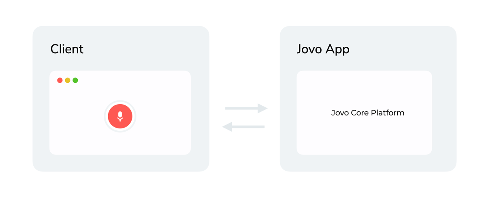

# Jovo Web Starter: Standalone Voice Experience

Fully customizable open source voice experience that can be hosted on any website.

Built with the [Jovo Framework](https://github.com/jovotech/jovo-framework), [Vue.js 2](https://github.com/vuejs/vue), and [Tailwind CSS](https://github.com/tailwindlabs/tailwindcss).

Demo: [jovo.tech/demos/starter-web-standalone](https://www.jovo.tech/demos/starter-web-standalone/).



> Support Jovo by starring [our main repo](https://github.com/jovotech/jovo-framework) or joining [our Open Collective](https://opencollective.com/jovo-framework).

- [Getting Started](#getting-started)
- [How it works](#how-it-works)
- [Customization](#customization)
  - [Client](#client)
  - [App](#app)
- [Deployment](#deployment)
- [About Jovo](#about-jovo)

## Getting Started

1.  **Download starter**

    Clone this repository and install the dependencies:

    ```sh
    git clone https://github.com/jovotech/jovo-starter-web-standalone.git

    cd jovo-starter-web-standalone

    npm install
    ```

2.  **Start client (Vue.js)**

    ```sh
     $ cd client

     # Start Vue frontend
     $ npm run serve
    ```

3.  **Start app (Jovo)**
    In a new tab:

    ```sh
    $ cd app

    # Start Jovo development server
    $ npm run start:dev
    ```

4.  **Open the starter in your browser at `http://localhost:8080`.**

    > Note: For demo purposes and the ease of getting started quickly, the template uses the [Web Speech API](https://wicg.github.io/speech-api/) as an ASR, which only works in Google Chrome.

## How it works



This repository contains:

- `app`: Backend logic built with the [Jovo Framework](https://github.com/jovotech/jovo-framework) using its [Web Platform integration](https://github.com/jovotech/jovo-framework/tree/v4/latest/platforms/platform-web).
- `client`: Frontend built with [Vue.js 2](https://vuejs.org/) and [Tailwind CSS](https://tailwindcss.com/), communicating with the backend using the [Jovo Web Client for Vue.js 2](https://github.com/jovotech/jovo-framework/tree/v4/latest/clients/client-web-vue2).

## Customization

The starter was built for you to have a working example as well as an entry point to get started with the Jovo Web integration.

The following documentation will help you understand how the starter is structured and which components take care of which tasks.

### Client

The client is a Vue.js project that consists of a single component "RecordButton" which is styled in Tailwind CSS.

If you are new to Vue.js and want to develop your website starting with this project, you can take a look at the Vue.js guide [here](https://vuejs.org/v2/guide/). This will give you a quick start to how Vue.js works, so you can start creating right away.

### App

The Jovo app uses the [Jovo Web Platform integration](http://jovo.tech/marketplace/platform-web) as well as [NLP.js](https://www.jovo.tech/marketplace/nlu-nlpjs) as its NLU.

#### Language Model

The language model consists of a single intent, `SwitchThemeIntent`, used to change the theme of the website to either dark or light mode.

## Deployment

### Client

> Take a look at the Vue deployment docs [here](https://cli.vuejs.org/guide/deployment).

To integrate Jovo Web Standalone into your existing project, you can use the npm script `build` inside of the `client/` directory. This will produce a bundle in a dedicated `dist/` directory, containing the whole Vue.js client with minified HTML, CSS and JavaScript, ready for dynamic integration into any website.

### App

You can host your Jovo app on almost any platform, whether you choose a hosting provider or to build your own Node.js-based HTTP server. Here are a few examples:

- [AWS Lambda](https://www.jovo.tech/marketplace/server-lambda)
- [Express](https://www.jovo.tech/marketplace/server-express)

## About Jovo

Jovo is the most popular development framework for voice, including platforms like Alexa, Google Assistant, and the web.

- [Jovo Website](https://jovo.tech/)
- [Documentation](https://jovo.tech/docs/)
- [Marketplace](https://www.jovo.tech/marketplace/)
- [Twitter](https://twitter.com/jovotech/)
- [Forum](https://community.jovo.tech/)
